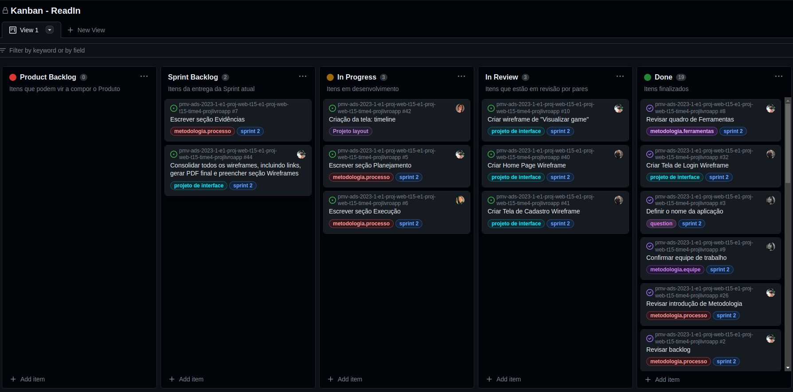
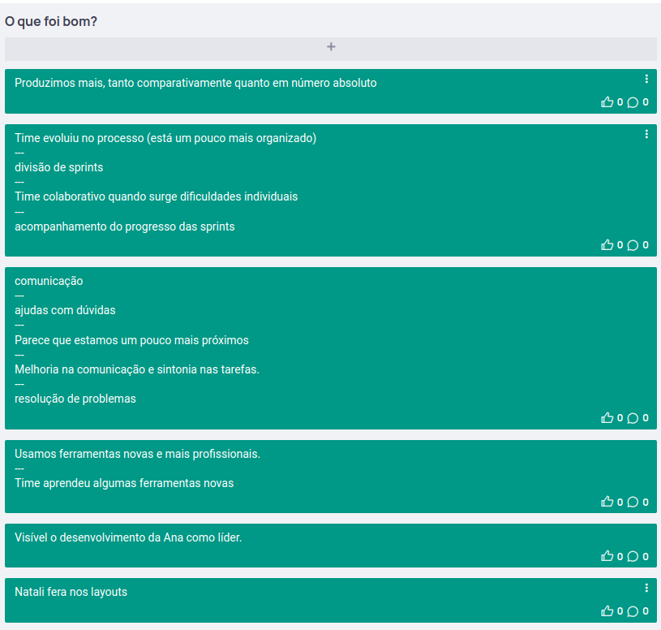
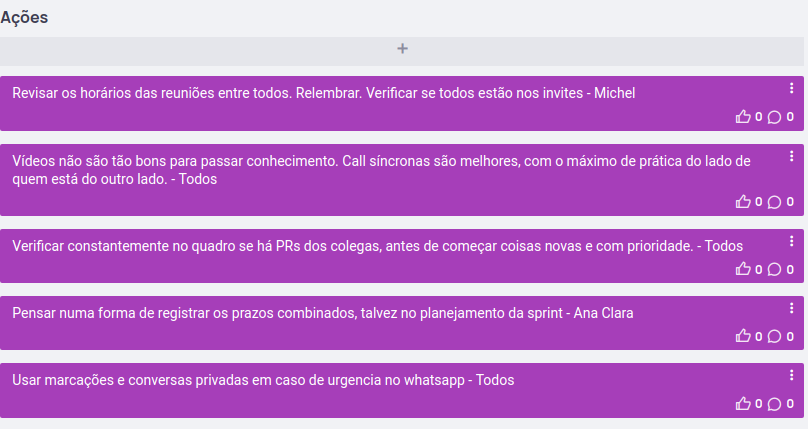

# Metodologia
A metodologia adotada pela equipe foi o [Scrum](https://scrumguides.org/docs/scrumguide/v2020/2020-Scrum-Guide-US.pdf) com as seguintes particularidades:

- a inspeção diária (_daily meeting_) será na verdade duas vezes por semana e em quaisquer outros encontros adicionais que o time entender necessários;
- a retrospectiva será feita ainda dentro da Sprint (ao final) para a coleta de informações para a seção **Execução** dentro de **Processo** (_ver abaixo_);
- a review será feita a critério do professor orientador.

## 1. Equipe de trabalho

Os papéis acordados dentro da equipe foram os seguintes:

| Papel                         | Responsável                                                                                                                   |
|-------------------------------|-------------------------------------------------------------------------------------------------------------------------------|
| **Scrum Master**              | Ana Clara Rozinholi                                                                                                           |
| **Product Owner**             | Michel Suzigan                                                                                                                |
| **Equipe de Design**          | Natali Xavier da Costa   Michel Faria Suzigan                                                                             |
| **Equipe de Desenvolvimento** | Victor Beltrão  Pablo Vinicius Ramos Lopes  Michel Faria Suzigan  Ana Clara Rozinholi  Natali Xavier da Costa |

### Processo de revisão por pares e convenções
A equipe decidiu adotar um padrão de revisão por pares baseado nas [Pull Requests (PR) do GitHub](https://docs.github.com/pt/pull-requests/collaborating-with-pull-requests/proposing-changes-to-your-work-with-pull-requests/creating-a-pull-request), da seguinte forma:

- o nome das _branches_ seguirá o padrão: `readin-n`, onde `n` é o código da _issue_ no [quadro de trabalho do time](https://github.com/orgs/ICEI-PUC-Minas-PMV-ADS/projects/362) correspondente àquela alteração. Exemplo:
  \
  \
  `readin-26` : [Revisar introdução de Metodologia](https://github.com/orgs/ICEI-PUC-Minas-PMV-ADS/projects/362/views/1?visibleFields=%5B%22Title%22%2C%22Assignees%22%2C%22Status%22%2C%22Labels%22%5D&pane=issue&itemId=25970136)

- a _branch_ `main` conterá o código de produção;
- não será permitido _push_ direto na branch `main`, devendo o _merge_ ser feito obrigatoriamente por PR;
- serão necessárias pelo menos duas aprovações na PR para ser permitido o _merge_.

## 2. Ferramentas e links

Os links da primeira coluna levam abrem os recursos que time está utilizando de cada uma das ferramentas listadas na segunda coluna.

| Objetivo                                                                                                                                   | Ferramenta                                                                     | 
|--------------------------------------------------------------------------------------------------------------------------------------------|--------------------------------------------------------------------------------| 
| [Quadro de trabalho/gerenciamento do projeto (Kanban)](https://github.com/orgs/ICEI-PUC-Minas-PMV-ADS/projects/362)                        | [GitHub Projects](https://github.com/orgs/ICEI-PUC-Minas-PMV-ADS/projects/362) |
| [Repositório de código-fonte](https://github.com/ICEI-PUC-Minas-PMV-ADS/pmv-ads-2023-1-e1-proj-web-t15-e1-proj-web-t15-time4-projlivroapp) | [GitHub](https://github.com/)                                                  | 
| [Documentos do projeto](../docs)                                                                                                           | [GitHub](https://github.com/)                                                  | 
| [Projeto de Interface](04-Projeto%20de%20Interface.md) e [Wireframes](wireframes)                                                          | [WireframeSketcher](https://wireframesketcher.com/)                            |
| Retrospectivas (ver para cada Sprint na seção Processo abaixo)                                                                             | [EasyRetro](https://easyretro.io/)                                             |
| Comunicação                                                                                                                                | Microsoft Teams, Whatsapp                                                      | 

## 3. Processo

### 3.1 Product backlog
| Sprint   | Etapa na disciplina                                                                                                                                                            | Entregáveis                                                                                                                         |
|----------|--------------------------------------------------------------------------------------------------------------------------------------------------------------------------------|-------------------------------------------------------------------------------------------------------------------------------------|
| Sprint 1 | [Etapa 1 - Análise do problema e especificação de requisitos](https://pucminas.instructure.com/courses/150446/pages/etapa-1-analise-do-problema-e-especificacao-de-requisitos) | <ul><li>Documentação de Contexto</li><li>Especificação do Projeto</li><li>Apresentação do Projeto</li> </ul>                        |
| Sprint 2 | [Etapa 2 - Projeto da solução](https://pucminas.instructure.com/courses/150446/pages/etapa-2-projeto-da-solucao)                                                               | <ul><li>Metodologia</li><li>Projeto de Interface</li><li>Arquitetura da Solução (opcional)</li> </ul>                               |
| Sprint 3 | [Etapa 3 - Desenvolvimento da solução - Parte 1](https://pucminas.instructure.com/courses/150446/pages/etapa-3-desenvolvimento-da-solucao-parte-1)                             | <ul><li>Template padrão do Site</li><li>Programação de Funcionalidades</li></ul>                                                    |
| Sprint 4 | [Etapa 4 - Desenvolvimento da solução - Parte 2](https://pucminas.instructure.com/courses/150446/pages/etapa-4-desenvolvimento-da-solucao-parte-2)                             | <ul><li>Programação das demais funcionalidades</li><li>Plano de Testes de Software</li><li>Registro de Testes de Software</li></ul> |
| Sprint 5 | [Etapa 5 - Implantação e apresentação da solução](https://pucminas.instructure.com/courses/150446/pages/etapa-5-implantacao-e-apresentacao-da-solucao)                         | <ul><li>Implantação da Solução</li><li>Vídeo de demonstração da Solução</li></ul>                                                   |

### 3.2 Sprint 1

#### 3.2.1 Planejamento e Execução

<table>
  <tr>
  <td align="center"><b>Entregável</b></td><td align="center"><b>Tarefa planejada</b></td><td align="center"><b>Responsável</b></td><td align="center"><b>Prazo</b></td></tr>
  <tr><td rowspan="5"><b>Documentação de Contexto</b></td><td>Escrever seção Introdução</td><td align="center">Equipe</td><td>02/04/2023</td></tr>
  <tr><td>Escrever seção Problema</td><td align="center">Equipe</td><td>02/04/2023</td></tr>
  <tr><td>Escrever seção Objetivos</td><td align="center">Michel Suzigan</td><td>02/04/2023</td></tr>
  <tr><td>Escrever seção Justificativa</td><td align="center">Natali da Costa</td><td>02/04/2023</td></tr>
  <tr><td>Escrever seção Público-alvo</td><td align="center">Pablo Vinícius</td><td>02/04/2023</td></tr>

  <tr>
  <td rowspan="7"><b>Especificação do Projeto</b></td><td>Elaborar pesquisa para investigação de personas</td><td align="center">Michel Suzigan</td><td>02/04/2023</td></tr>
  <tr><td>Executar pesquisa para investigação de personas</td><td align="center">Equipe</td><td>02/04/2023</td></tr>
  <tr><td>Escrever seção Personas</td><td align="center">Michel Suzigan</td><td>02/04/2023</td></tr>
  <tr><td>Escrever seção Histórias de usuários</td><td align="center">Michel Suzigan</td><td>02/04/2023</td></tr>
  <tr><td>Escrever seção Requisitos funcionais</td><td align="center">Ana Clara Rozinholi</td><td>02/04/2023</td></tr>
  <tr><td>Escrever seção Requisitos não-funcionais</td><td align="center">Ana Clara Rozinholi</td><td>02/04/2023</td></tr>
  <tr><td>Escrever seção Restrições</td><td align="center">Victor Beltrão</td><td>02/04/2023</td></tr>

  <tr><td rowspan="2"><b>Apresentação do Projeto</b></td><td>Elaborar apresentação</td><td align="center">Ana Clara Rozinholi, Natali da Costa, Michel Suzigan</td><td>02/04/2023</td></tr>
  <tr><td>Executar apresentação</td><td align="center">Ana Clara Rozinholi, Michel Suzigan</td><td>03/04/2023</td></tr>
</table>

#### 3.2.2 Evidências

- [Documentação de Contexto](01-Documentação%20de%20Contexto.md)
- [Especificação do Projeto](02-Especificação%20do%20Projeto.md)
- [Apresentação do Projeto](../presentation/Apresentacao1_ProjLivroApp.pdf)

### 3.3 Sprint 2

#### 3.3.1 Planejamento e Execução

<i><a href="https://github.com/orgs/ICEI-PUC-Minas-PMV-ADS/projects/362">Quadro de trabalho do time no dia 21/04/2023</a></i>

 
<i><b>Observação:</b> A equipe optou por reservar o trabalho da membro Natali da Costa para a construção do layout da aplicação (tarefa prevista para a próxima Sprint).</i>
 
 
<table>
  <tr>
  <td align="center"><b>Entregável</b></td><td  align="center"><b>Tarefa planejada</b></td><td align="center"><b>Responsável</b></td><td align="center"><b>Prazo</b></td></tr>
  <tr><td rowspan="9"><b>Metodologia</b></td><td><a href="https://github.com/ICEI-PUC-Minas-PMV-ADS/pmv-ads-2023-1-e1-proj-web-t15-e1-proj-web-t15-time4-projlivroapp/issues/9">Confirmar equipe de trabalho</a></td><td align="center">Ana Clara Rozinholi</td><td>23/04/2023</td></tr>
  <tr><td><a href="https://github.com/ICEI-PUC-Minas-PMV-ADS/pmv-ads-2023-1-e1-proj-web-t15-e1-proj-web-t15-time4-projlivroapp/issues/8">Revisar quadro de Ferramentas</a></td><td align="center">Michel Suzigan</td><td>23/04/2023</td></tr>
  <tr><td><a href="https://github.com/ICEI-PUC-Minas-PMV-ADS/pmv-ads-2023-1-e1-proj-web-t15-e1-proj-web-t15-time4-projlivroapp/issues/26">Revisar introdução de Metodologia</a></td><td align="center">Michel Suzigan</td><td>23/04/2023</td></tr>
  <tr><td><a href="https://github.com/ICEI-PUC-Minas-PMV-ADS/pmv-ads-2023-1-e1-proj-web-t15-e1-proj-web-t15-time4-projlivroapp/issues/17">Definir o modelo de revisão dos artefatos</a></td><td align="center">Ana Clara Rozinholi, Michel Suzigan</td><td>23/04/2023</td></tr>
  <tr><td><a href="https://github.com/ICEI-PUC-Minas-PMV-ADS/pmv-ads-2023-1-e1-proj-web-t15-e1-proj-web-t15-time4-projlivroapp/issues/7">Escrever seção Evidências</a></td><td align="center">Michel Suzigan</td><td>23/04/2023</td></tr>
  <tr><td><a href="https://github.com/ICEI-PUC-Minas-PMV-ADS/pmv-ads-2023-1-e1-proj-web-t15-e1-proj-web-t15-time4-projlivroapp/issues/6">Escrever seção Execução</a></td><td align="center">Victor Beltrão Silva</td><td>23/04/2023</td></tr>
  <tr><td><a href="https://github.com/ICEI-PUC-Minas-PMV-ADS/pmv-ads-2023-1-e1-proj-web-t15-e1-proj-web-t15-time4-projlivroapp/issues/5">Escrever seção Planejamento</a></td><td align="center">Michel Suzigan</td><td>23/04/2023</td></tr>
  <tr><td><a href="https://github.com/ICEI-PUC-Minas-PMV-ADS/pmv-ads-2023-1-e1-proj-web-t15-e1-proj-web-t15-time4-projlivroapp/issues/4">Executar retrospectiva</a></td><td align="center">Ana Clara Rozinholi</td><td>23/04/2023</td></tr>
  <tr><td><a href="https://github.com/ICEI-PUC-Minas-PMV-ADS/pmv-ads-2023-1-e1-proj-web-t15-e1-proj-web-t15-time4-projlivroapp/issues/2">Revisar backlog</a></td><td align="center">Michel Suzigan</td><td>23/04/2023</td></tr>
  <tr><td rowspan="18"><b>Projeto de interface</b></td><td><a href="https://github.com/ICEI-PUC-Minas-PMV-ADS/pmv-ads-2023-1-e1-proj-web-t15-e1-proj-web-t15-time4-projlivroapp/issues/44">Consolidar todos os wireframes, incluindo links, gerar PDF final e preencher seção Wireframes</a></td><td align="center">Michel Suzigan</td><td>23/04/2023</td></tr>
  <tr><td><a href="https://github.com/ICEI-PUC-Minas-PMV-ADS/pmv-ads-2023-1-e1-proj-web-t15-e1-proj-web-t15-time4-projlivroapp/issues/41">Criar Tela de Cadastro Wireframe</a></td><td align="center">Pablo Vinicius </td><td>23/04/2023</td></tr>
  <tr><td><a href="https://github.com/ICEI-PUC-Minas-PMV-ADS/pmv-ads-2023-1-e1-proj-web-t15-e1-proj-web-t15-time4-projlivroapp/issues/40">Criar Home Page Wireframe</a></td><td align="center">Pablo Vinicius </td><td>23/04/2023</td></tr>
  <tr><td><a href="https://github.com/ICEI-PUC-Minas-PMV-ADS/pmv-ads-2023-1-e1-proj-web-t15-e1-proj-web-t15-time4-projlivroapp/issues/34">Ajustar progresso de leitura na timeline</a></td><td align="center">Michel Suzigan</td><td>23/04/2023</td></tr>
  <tr><td><a href="https://github.com/ICEI-PUC-Minas-PMV-ADS/pmv-ads-2023-1-e1-proj-web-t15-e1-proj-web-t15-time4-projlivroapp/issues/32">Criar Tela de Login Wireframe</a></td><td align="center">Pablo Vinicius </td><td>23/04/2023</td></tr>
  <tr><td><a href="https://github.com/ICEI-PUC-Minas-PMV-ADS/pmv-ads-2023-1-e1-proj-web-t15-e1-proj-web-t15-time4-projlivroapp/issues/25">Criar wireframe Wishlists</a></td><td align="center">Ana Clara Rozinholi</td><td>23/04/2023</td></tr>
  <tr><td><a href="https://github.com/ICEI-PUC-Minas-PMV-ADS/pmv-ads-2023-1-e1-proj-web-t15-e1-proj-web-t15-time4-projlivroapp/issues/24">Criar wireframe "visualizar perfil (de outro usuário)"</a></td><td align="center">Victor Beltrão Silva</td><td>23/04/2023</td></tr>
  <tr><td><a href="https://github.com/ICEI-PUC-Minas-PMV-ADS/pmv-ads-2023-1-e1-proj-web-t15-e1-proj-web-t15-time4-projlivroapp/issues/23">Criar wireframe "visualizar leituras (de outro usuário)"</a></td><td align="center">Victor Beltrão Silva</td><td>23/04/2023</td></tr>
  <tr><td><a href="https://github.com/ICEI-PUC-Minas-PMV-ADS/pmv-ads-2023-1-e1-proj-web-t15-e1-proj-web-t15-time4-projlivroapp/issues/22">Criar wireframe "editar perfil"</a></td><td align="center">Victor Beltrão Silva</td><td>23/04/2023</td></tr>
  <tr><td><a href="https://github.com/ICEI-PUC-Minas-PMV-ADS/pmv-ads-2023-1-e1-proj-web-t15-e1-proj-web-t15-time4-projlivroapp/issues/19">Criar wireframe Minhas Leituras</a></td><td align="center">Ana Clara Rozinholi</td><td>23/04/2023</td></tr>
  <tr><td><a href="https://github.com/ICEI-PUC-Minas-PMV-ADS/pmv-ads-2023-1-e1-proj-web-t15-e1-proj-web-t15-time4-projlivroapp/issues/18">Criar wireframe "meu perfil"</a></td><td align="center">Victor Beltrão Silva</td><td>23/04/2023</td></tr>
  <tr><td><a href="https://github.com/ICEI-PUC-Minas-PMV-ADS/pmv-ads-2023-1-e1-proj-web-t15-e1-proj-web-t15-time4-projlivroapp/issues/16">Criar wireframe "Visualizar timeline"</a></td><td align="center">Michel Suzigan</td><td>23/04/2023</td></tr>
  <tr><td><a href="https://github.com/ICEI-PUC-Minas-PMV-ADS/pmv-ads-2023-1-e1-proj-web-t15-e1-proj-web-t15-time4-projlivroapp/issues/15">Criar wireframe "Meus grupos de leitura"</a></td><td align="center">Michel Suzigan</td><td>23/04/2023</td></tr>
  <tr><td><a href="https://github.com/ICEI-PUC-Minas-PMV-ADS/pmv-ads-2023-1-e1-proj-web-t15-e1-proj-web-t15-time4-projlivroapp/issues/11">Projetar e preencher seção fluxo do usuário</a></td><td align="center">Michel Suzigan</td><td>23/04/2023</td></tr>
  <tr><td><a href="https://github.com/ICEI-PUC-Minas-PMV-ADS/pmv-ads-2023-1-e1-proj-web-t15-e1-proj-web-t15-time4-projlivroapp/issues/10">Criar wireframe de "Visualizar game"</a></td><td align="center">Michel Suzigan</td><td>23/04/2023</td></tr>
  <tr><td><a href="https://github.com/ICEI-PUC-Minas-PMV-ADS/pmv-ads-2023-1-e1-proj-web-t15-e1-proj-web-t15-time4-projlivroapp/issues/12">Definir o nome da competição ou competições da aplicação</a></td><td align="center">Equipe</td><td>23/04/2023</td></tr>
  <tr><td><a href="https://github.com/ICEI-PUC-Minas-PMV-ADS/pmv-ads-2023-1-e1-proj-web-t15-e1-proj-web-t15-time4-projlivroapp/issues/3">Definir o nome da aplicação</a></td><td align="center">Equipe</td><td>23/04/2023</td></tr>
</table>

#### 3.3.2 Retrospectiva

| O que foi bom                                                                  | O que podemos melhorar                                                                  | Ações                                                                  |
|--------------------------------------------------------------------------------|-----------------------------------------------------------------------------------------|------------------------------------------------------------------------|
|  |  |  |

#### 3.3.3 Evidências
- Metodologia (esta página)
- [Projeto de Interface](04-Projeto%20de%20Interface.md)
