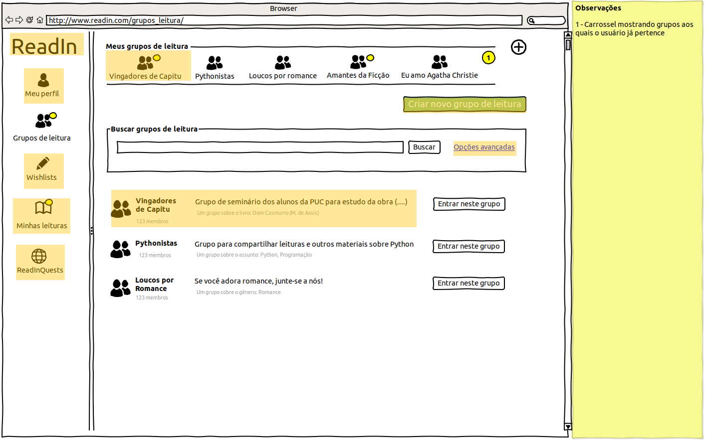
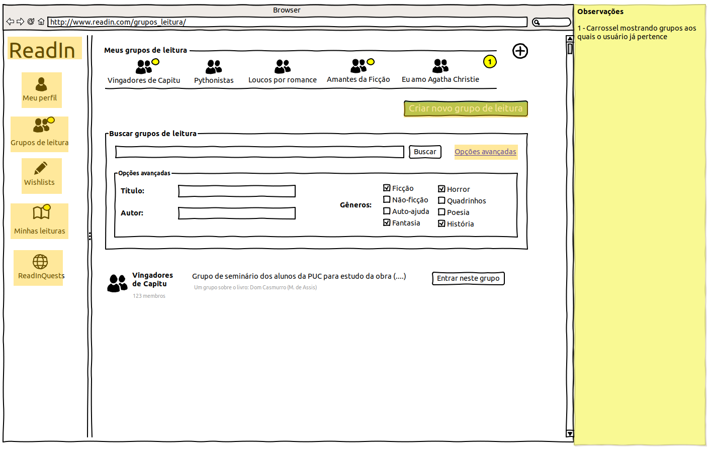
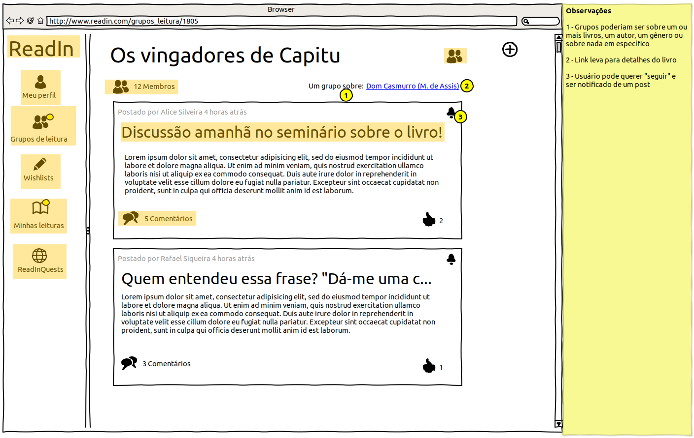
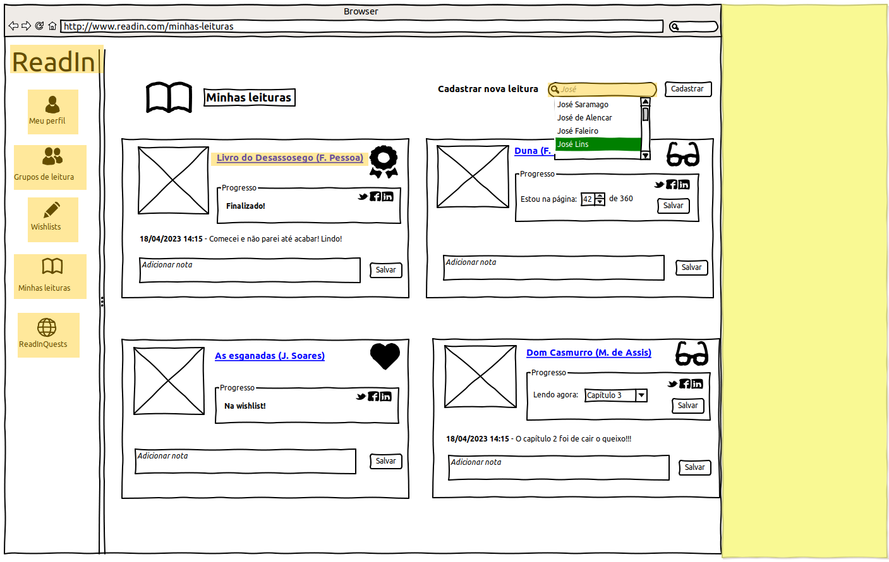
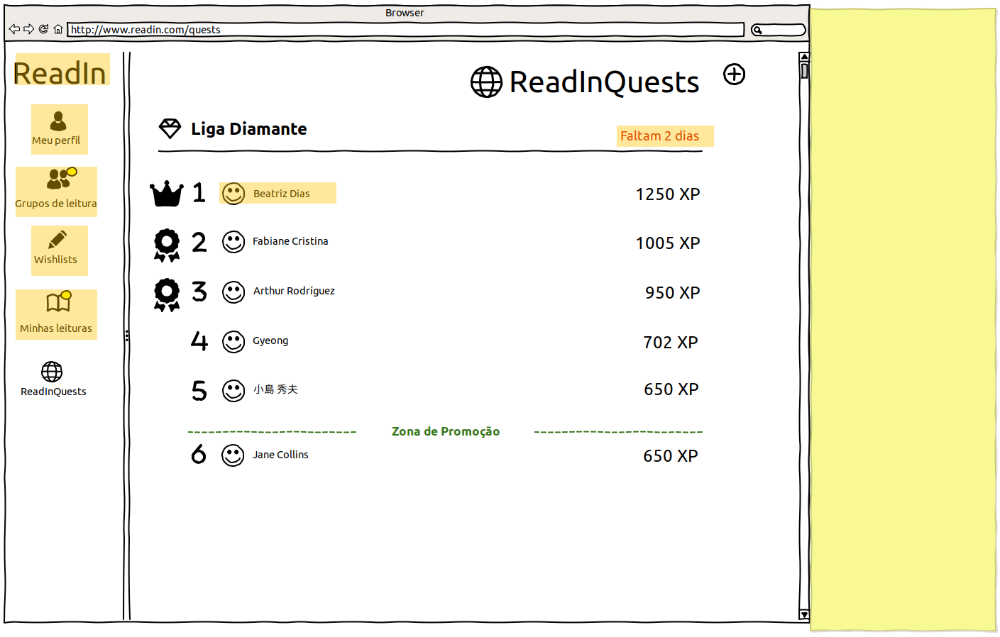
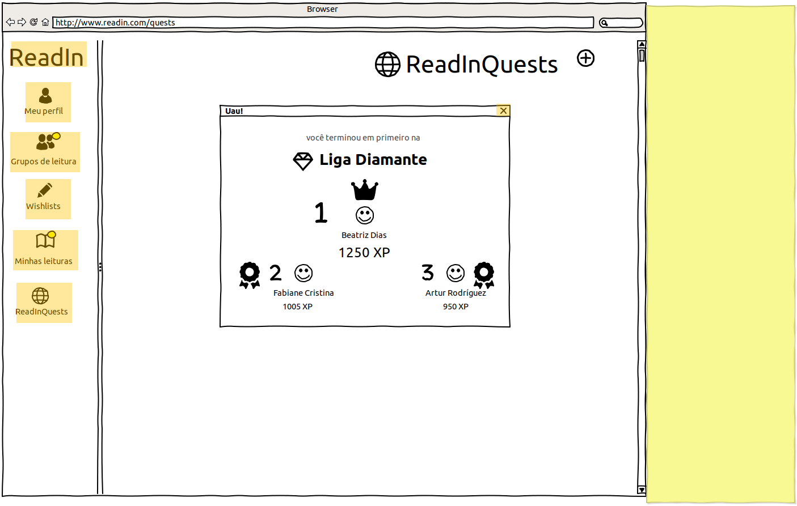
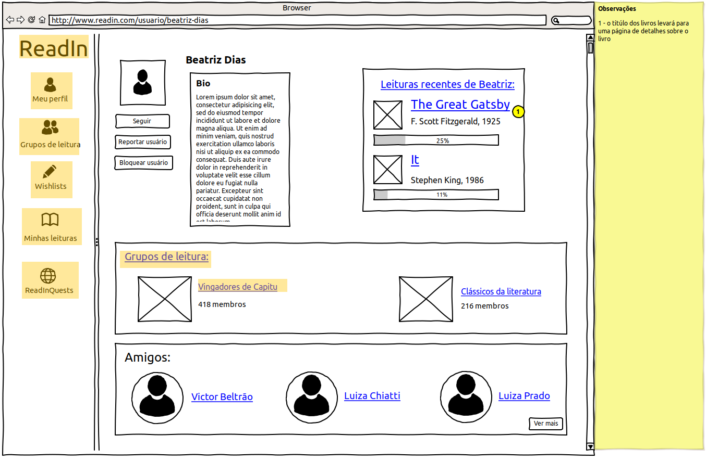

# Projeto de Interface

As interfaces foram elaboradas em diversas rodadas de discussão e revisão entre os membros do time (ver [Metodologia - Processo de revisão](./03-Metodologia.md#processo-de-revisão-por-pares-e-convenções)) a fim de satisfazer os [requisitos funcionais e não-funcionais](./02-Especificação%20do%20Projeto.md#requisitos).  

O time está ciente que, à medida que caminha nas Sprints, revisões no backlog (e, portanto, nas interfaces) serão necessárias e esse caráter iterativo é característica de um processo ágil.

## User Flow

Para efeito de clareza lógica, o fluxo de usuário foi divido em três partes:

- **Home, Cadastro e Autenticação**, primeiros pontos de contato do usuário com a aplicação e onde é assegurada sua identificação;
- **Timeline e seus links**, tela-chave da aplicação pois oferecerá ao usuário o conteúdo mais imediatamente relevante (compartilhado por seus amigos, selecionado pelos algoritmos de recomendação) bem como links que o permitirão navegar pelo restante do sistema;
- **Funcionalidades**, telas específicas para cada _feature_ projetada para a aplicação.

## Wireframes

A <b>melhor forma</b> de visualizar os wireframes é através do <b>PDF interativo consolidado</b> em <b>tela cheia</b>: faça o download aqui 

Abaixo, a lista dos wireframes:

<table>
    <tr>
        <td>
Login
</td>
        <td>
Registrar usuário
</td>
        <td>
Timeline - início
</td>
        <td>
Timeline - adicionar progresso de leitura
</td>
        <td>
Timeline - adicionar nota
</td>
    </tr>
    <tr>
        <td>
Grupos de leitura - início
</td>
        <td>
Grupos de leitura - novo grupo
</td>
        <td>
Grupos de leitura - opções avançadas de busca
</td>
        <td>
Grupos de leitura - Detalhe de grupo
</td>
        <td>
Grupos de leitura - Membros de grupo
</td>
    </tr>
    <tr>
        <td>
Grupos de leitura - Post em grupo
</td>
        <td>
Editar perfil
</td>
        <td>
Minhas leituras - início
</td>
        <td>
Minhas leituras - cadastrar leitura
</td>
        <td>
Minhas leituras - resumo de livro
</td>
    </tr>
    <tr>
        <td>
Meu perfil
</td>
        <td>
ReadInQuests - início
</td>
        <td>
ReadInQuests - quest finalizado
</td>
        <td>
Visualizar um perfil
</td>
        <td>
Wishlists
</td>
    </tr>
</table>
